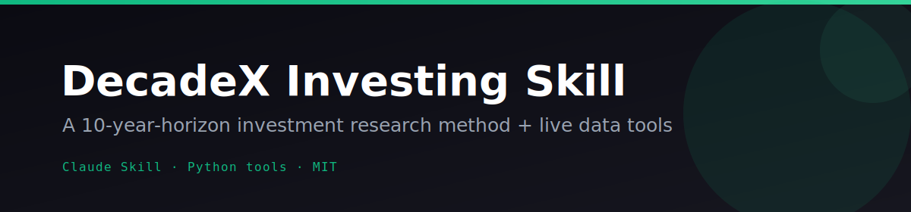
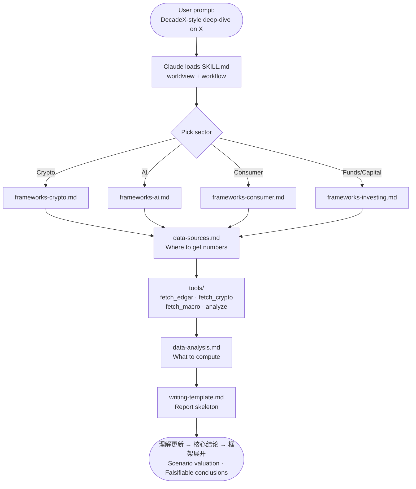

<p align="center"></p>

<p align="center">
  <a href="LICENSE"></a>
  
  
  
  
</p>

---

# 📈 DecadeX Investing Skill

**A Claude skill that teaches long-horizon investment research in the style of [DecadeX (未来十年投资学堂)](https://decadex.org).** It encodes DecadeX's named frameworks, house worldview, and end-to-end report structure so an analyst — or Claude — can produce 10-year-horizon deep-dives across Crypto, AI, Consumer, and Funds/Capital. It also ships **four free, no-key data tools** (SEC EDGAR, CoinGecko+DefiLlama, Treasury+FRED, and a pure valuation calculator) so every analysis is grounded in real numbers rather than vibes.

> **Educational only.** This skill distills DecadeX's *public research methodology*, not its predictions. It is NOT financial advice, NOT affiliated with or endorsed by DecadeX, and reproducing a house's reasoning style does not make its conclusions correct. All investing carries substantial risk. Consult a licensed advisor.

---

## ✨ Features

- **Full DecadeX research arc** — opens with 理解更新 (versioned self-critique), re-derives the category from first principles, deploys named frameworks with numbers, runs the 尽调十问 (β/α/Timing) scorecard, and closes with conditional, falsifiable conclusions
- **Cross-cutting frameworks encoded** — 不可能三角, 北极星指标, 价值创造 vs 价值捕获, 流量×流动性, 资产渗透率, 技术革命与金融资本 (Perez cycle), 三情景概率加权估值, and more — each stated then *applied with numbers*
- **Sector-specific playbooks** — dedicated reference files for Crypto (trilemma re-ordering, REV/GDP 税权, settlement stack, exchange 三分类, PerpDex), AI (Pre×Post×TTS, Scaling Law, ad-revenue decomposition), Funds/Capital (VC vintage power law, LP 三诉求), and Consumer (hardware→SaaS migration, GMV dual-path)
- **Four free, stdlib-only data tools** — fetch SEC EDGAR financials, CoinGecko/DefiLlama crypto data, Treasury/FRED macro series, and run reverse-DCF + scenario valuation — no `pip install`, no API key required
- **Train/test evaluated** — built from 24 training reports, held out on 7 unseen reports; blind-analyst avg similarity **83.6%** after two rounds of self-improvement
- **Visual cheatsheet** — `cheatsheet.html` puts every framework on one printable page
- **Immutable, robust tooling** — all scripts follow immutable style, exit non-zero on failure with actionable stderr messages, and never hardcode secrets

---

## 🎬 How it works



---

## 🚀 Quickstart

### Install as a Claude Code skill

```bash
# Project-level (recommended — active for this project only)
git clone https://github.com/Alchemist-X/decade-x-investing-skill.git .claude/skills/decade-x-investing

# User-level (active across all your projects)
git clone https://github.com/Alchemist-X/decade-x-investing-skill.git ~/.claude/skills/decade-x-investing
```

Claude Code auto-discovers skills in `.claude/skills/`. The `SKILL.md` frontmatter registers the name and trigger description. Then just ask:

```
"Write a DecadeX-style deep-dive on Coinbase."
"Apply DecadeX's 不可能三角 / REV/GDP 税权 framework to Solana."
"Value NVDA the DecadeX way — three-scenario PS/PE with a regulatory discount."
"Run the 尽调十问 (β/α/Timing) on Benchmark Capital."
"Reproduce a DecadeX report on Ethereum L2 in their 理解更新→核心结论→框架展开 structure."
```

### Run the data tools directly

All four tools require only Python 3 and zero third-party dependencies:

```bash
# Pull SEC EDGAR financials (no key)
python3 tools/fetch_edgar.py NVDA --metric RevenueFromContractWithCustomerExcludingAssessedTax
python3 tools/fetch_edgar.py COIN --metric NetIncomeLoss --json

# Token price + on-chain TVL (no key)
python3 tools/fetch_crypto.py price bitcoin ethereum
python3 tools/fetch_crypto.py tvl ethereum
python3 tools/fetch_crypto.py protocol-tvl aave

# US Treasury rates + FRED macro series
python3 tools/fetch_macro.py treasury          # no key
python3 tools/fetch_macro.py fred CPIAUCSL     # needs FRED_API_KEY (free)

# Pure valuation — reverse-DCF, 3-scenario, owner-yield (no network, no key)
python3 tools/analyze.py reverse-dcf --mktcap 3e12 --fcf 9e10 --discount 0.10 --tgrowth 0.03
python3 tools/analyze.py owner-yield --oe 9e10 --mktcap 3e12
python3 tools/analyze.py scenarios --json '[{"label":"Bear","prob":0.3,"value":100},{"label":"Base","prob":0.5,"value":200},{"label":"Bull","prob":0.2,"value":400}]' --price 180
```

**Typical chain:** `fetch_edgar.py` → CFO − CapEx = FCF → `analyze.py reverse-dcf` / `owner-yield` → `analyze.py scenarios`

### Manual reference (no Claude Code required)

Copy `SKILL.md`, `references/`, and `cheatsheet.html` anywhere and reference them directly. Open `cheatsheet.html` in a browser for the visual one-pager of all frameworks.

---

## ⚙️ Configuration

All tools run keyless out of the box. Optional environment variables raise rate limits or unlock additional data sources — never required, never hardcoded:

| Variable | Tool | Purpose |
|---|---|---|
| `SEC_USER_AGENT` | `fetch_edgar.py` | Polite User-Agent for SEC EDGAR (e.g. `"Your Name your@email.com"`) |
| `COINGECKO_API_KEY` | `fetch_crypto.py` | Free demo key to raise CoinGecko rate limit (HTTP 429 = you hit the public limit) |
| `FRED_API_KEY` | `fetch_macro.py` | Free key from [fredaccount.stlouisfed.org/apikeys](https://fredaccount.stlouisfed.org/apikeys) — unlocks the `fred` subcommand |
| `DECADEX_API_KEY` | `analyze.py` | Output label only — `analyze.py` makes zero network calls |

If you use an OpenAI-compatible LLM endpoint (Kimi/Moonshot, a local model, etc.) instead of Claude Code, the skill works with any model that can read Markdown files — point it at `SKILL.md` and the `references/` folder:

```bash
export LLM_API_KEY=your_key_here
export LLM_BASE_URL=https://api.moonshot.cn/v1   # or https://api.openai.com/v1
export LLM_MODEL=moonshot-v1-128k                # or gpt-4o, etc.
```

The skill itself has no LLM dependency — it is pure Markdown context injected into any model.

---

## 🗺️ Roadmap / Needs

The skill is already evaluated and functional. These are the honest open items from the eval:

- **`eth-layer2` ecosystem topics** — single-company deep-dives score 85-92; multi-actor ecosystem reads (mapping a whole L2 landscape) expose framework gaps and would benefit from richer competitive-landscape templates
- **`coinbase`-style insight reframing** — the "not just an exchange" reframe improved from gap 47 → 23 with data tooling, but the residual ~23-point gap traces to granular competitor/dashboard data (Token Terminal, Messari) that the keyless tools can't fetch; a paid-data adapter would close it
- **`microsoft` AIGC bottom-up** — the AI frameworks correctly identify the lenses (Copilot/token economics, SKU-level margin) but benefit from a more explicit per-SKU revenue build template
- **Re-runnable eval harness** — `corpus/fetch_corpus.py` + `eval/split.json` are in place; a thin Python script to automate the blind-analyst → judge → score loop would make future improvement rounds push-button

Contributions welcome — see the eval methodology in `eval/RESULTS.md` for how to measure whether a change actually helps.

---

## 📄 License

[MIT](LICENSE) — free to use, modify, and distribute. See `LICENSE` for the full text.

---

> **Disclaimer:** This project and all associated files are for educational and informational purposes only. Nothing here is personalized financial advice, a recommendation to buy/sell/hold any security or token, a solicitation, or a guarantee of any outcome. It is a distillation of DecadeX's *public research methodology* and is not affiliated with, authorized by, or endorsed by DecadeX. Investing involves substantial risk including possible loss of your entire principal; past performance does not predict future results. Consult a qualified, licensed financial advisor before making any investment decision.

---

<p align="center">⭐ Star this repo if it's useful — it helps others find the methodology.</p>
